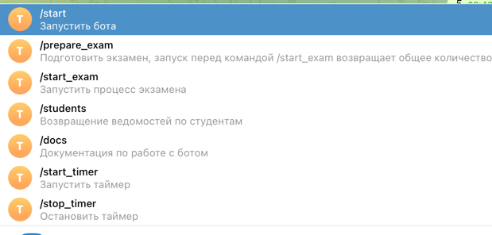
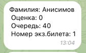

## Project Structure
```plaintext
.
.
├── Dockerfile
├── Makefile
├── README.md
├── alembic.ini
├── bot
│   ├── Dockerfile
│   ├── __init__.py
│   ├── app
│   │   ├── __init__.py
│   │   ├── bot_instance.py
│   │   ├── config.py
│   │   ├── handlers
│   │   │   ├── __init__.py
│   │   │   ├── main_handlers.py
│   │   │   └── timer_handler.py
│   │   ├── logger
│   │   │   ├── __init__.py
│   │   │   └── logger_file.py
│   │   ├── main.py
│   │   ├── migrations
│   │   │   ├── README
│   │   │   ├── __init__.py
│   │   │   ├── env.py
│   │   │   ├── script.py.mako
│   │   │   └── versions
│   │   │       ├── 01f32f5f2032_init_migration.py
│   │   │       └── 04ed87c42507_init_migration.py
│   │   ├── models
│   │   │   └── __init__.py
│   │   ├── repositories
│   │   │   ├── CRUD.py
│   │   │   ├── __init__.py
│   │   │   ├── database.py
│   │   │   └── models.py
│   │   ├── services
│   │   │   ├── Exam
│   │   │   │   ├── __init__.py
│   │   │   │   ├── form_questions.py
│   │   │   │   ├── time_constants.py
│   │   │   │   └── timer.py
│   │   │   ├── __init__.py
│   │   │   ├── report.py
│   │   │   └── selenium_parser
│   │   │       ├── __init__.py
│   │   │       ├── parcer.py
│   │   │       ├── selenium_instance.py
│   │   │       └── utils.py
│   │   └── yml_files
│   │       ├── links.yml
│   │       └── questions.yml
│   └── logger_info
│       └── logger_file.log
├── core
│   ├── __init__.py
│   ├── config.py
│   ├── database.py
│   ├── models
│   │   └── __init__.py
│   └── repositories
│       └── __init__.py
├── docker-compose.yml
├── img.png
├── img_1.png
├── poetry.lock
├── pyproject.toml
├── static
│   ├── script.js
│   └── styles.css
├── templates
│   └── students.html
├── tests
│   ├── __init__.py
│   ├── exam_timer_preparations.py
└── web
    ├── Dockerfile
    ├── __init__.py
    └── app
        ├── __init__.py
        ├── config.py
        ├── main.py
        ├── models
        │   └── __init__.py
        ├── repositories
        │   ├── CRUD.py
        │   ├── __init__.py
        └

```


Алгоритм работы:
сделать .env файл из .env.example
make build
make up
временно поменять в .env postgres > localhost
alembic upgrade head - создаст таблицы

работа с самим ботом 
1. /prepare_exam - парсинг и создание таблиц и реляций
2. /exam_timer - поставить на таймер экзамен
3. /students - ведомости


handlers:
# */start*
- запуск бота. Возвращает краткую справку по работе с ботом, а также текущую версию бота
версия бота - хранится в .env, парсится через pydantic в файле config.
Современный вывод:

Hello! ExamBot version 1.1.2

Run /command_prepare_exam to get the students out of API cite
Don't forget to insert your credentials into .env file
And provide links into bot/yml_files/links in .yml formatGood luck with the exam


# */prepare_exam*
Через Selenium обращаемся на сайт для начала парсинга данных
#TODO сделать временное хранение login-password для преподавателей для передачи их в функцию для парсинга 
#TODO2 должна поступать помимо логин-пароль также ссылки на страницы
#TODO3 либо же сделать чтобы бот принимал .txt файл для парсинга из заноса в БД

# */start_timer*
Запускает процесс экзамена.
запрашивает режим работы(1 | 2)
запрашивает необходимые числа для 
формирования таймера.

Учавствуют модули:
#TODO отметить модули....

# */stop_timer*
останавливает процесс экзамена


# */students*
Возвращает ведомости по студентам в формате:



# */docs*
возвращает полную документацию по работе с ботом
по